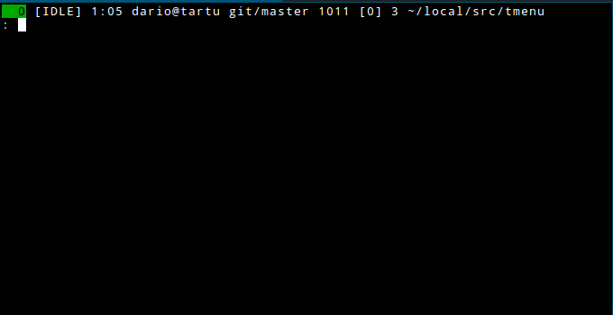

# Description

**tmenu** is a dynamic menu for tty devices, which reads a list of
newline-separated items from stdin.  When the user selects an item and
presses Return, the selected item is printed to stdout.  Entering text
will narrow the list of items to items that contain the entered text.

# Non/Features

- written in POSIX C99
- emacs-like key bindings
- does not use ncurses

# Installation

    make
    sudo make install

`make install` installs to `/usr/local` by default.  If you want to
install tmenu to a different location, set `PREFIX`:

    make install PREFIX=$HOME/local

# License

Copyright 2014 Dario Hamidi

This program is free software: you can redistribute it and/or modify
it under the terms of the GNU General Public License as published by
the Free Software Foundation, either version 3 of the License, or
(at your option) any later version.

This program is distributed in the hope that it will be useful,
but WITHOUT ANY WARRANTY; without even the implied warranty of
MERCHANTABILITY or FITNESS FOR A PARTICULAR PURPOSE.  See the
GNU General Public License for more details.

You should have received a copy of the GNU General Public License
along with this program.  If not, see <http://www.gnu.org/licenses/>.
